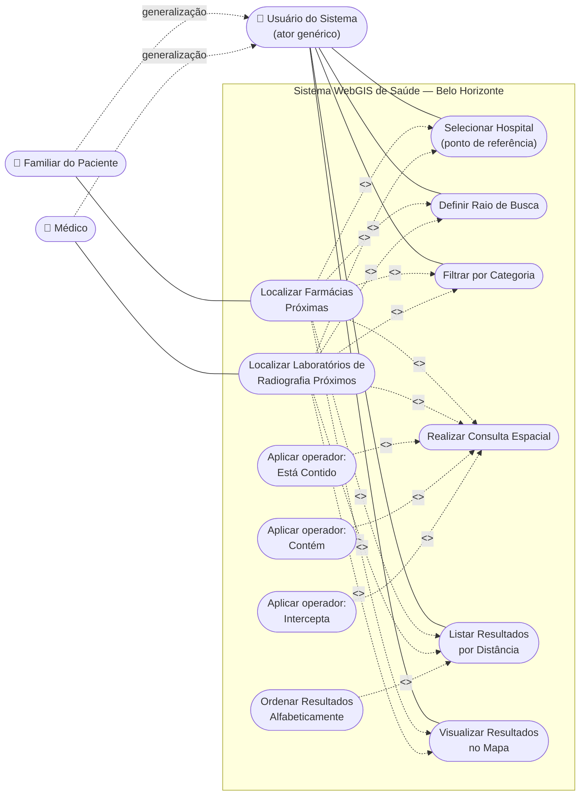

# Entregável 1 — Diagrama de Casos de Uso

## Arquivos

- `diagrama-casos-de-uso.puml`: fonte **PlantUML** com a notação UML completa
  (atores, fronteira do sistema, `<<include>>`, `<<extend>>` e generalização
  de atores). Pode ser renderizado em [plantuml.com/plantuml](https://www.plantuml.com/plantuml/uml/)
  ou em qualquer editor com plugin PlantUML (VS Code, IntelliJ, etc.).
- Este arquivo (`diagrama-casos-de-uso.md`): versão equivalente em **Mermaid**
  (renderiza direto no GitHub/GitLab) mais a leitura comentada do diagrama.

## Diagrama (Mermaid)

> Mermaid não possui um tipo nativo "use case diagram", então a notação UML é
> reproduzida com um fluxograma: atores fora da fronteira, casos de uso como
> nós arredondados dentro do retângulo que representa o sistema, e arestas
> tracejadas rotuladas para `<<include>>` / `<<extend>>`. A fonte
> PlantUML acima é a referência formal em notação UML de casos de uso.

## Leitura do diagrama

### Atores

| Ator | Papel |
|---|---|
| **Familiar do Paciente** | busca farmácias próximas ao hospital onde o paciente está internado (Estória 1). |
| **Médico** | busca laboratórios de radiografia próximos ao hospital para encaminhar o paciente (Estória 2). |
| **Usuário do Sistema** | ator genérico/abstrato que concentra os casos de uso comuns às duas especializações (`Familiar` e `Médico` generalizam `Usuário do Sistema`), evitando duplicar associações que são idênticas para os dois papéis. |

### Casos de uso centrais

- **Localizar Farmácias Próximas** (ator: Familiar) e **Localizar Laboratórios
  de Radiografia Próximos** (ator: Médico) são os casos de uso principais,
  cada um incluindo (`<<include>>`) obrigatoriamente:
  - `Selecionar Hospital` — define o ponto de referência da busca;
  - `Definir Raio de Busca` — distância máxima de varredura (200 m, 500 m,
    1000 m, 2000 m ou valor customizado);
  - `Filtrar por Categoria` — restringe o tipo de estabelecimento buscado;
  - `Realizar Consulta Espacial` — motor de consulta geográfica do sistema;
  - `Listar Resultados por Distância` — apresentação ordenada dos achados;
  - `Visualizar Resultados no Mapa` — plotagem dos resultados sobre o mapa.

- **Realizar Consulta Espacial** é estendido (`<<extend>>`) pelos três
  operadores espaciais exigidos pelo enunciado, cada um aplicável conforme o
  contexto da consulta:
  - `Aplicar operador: Está Contido` — testa se o estabelecimento (ponto)
    está contido no raio de busca (polígono circular) ou em um polígono de
    bairro;
  - `Aplicar operador: Contém` — testa se um polígono (ex.: bairro) contém o
    hospital ou um estabelecimento;
  - `Aplicar operador: Intercepta` — testa se uma via/rota (linha) intercepta
    a área de busca (círculo do raio).

- **Ordenar Resultados Alfabeticamente** estende `Listar Resultados por
  Distância`, oferecendo ao usuário um critério de ordenação alternativo (o
  enunciado pede: "resultados … em ordem de aproximação **ou** alfabética").

### Fronteira do sistema

A fronteira (`rectangle "Sistema WebGIS de Saúde - Belo Horizonte"` no
PlantUML / `subgraph SIS` no Mermaid) delimita exatamente os casos de uso que
o sistema WebGIS implementa; os atores ficam fora dela, interagindo por meio
do navegador.
